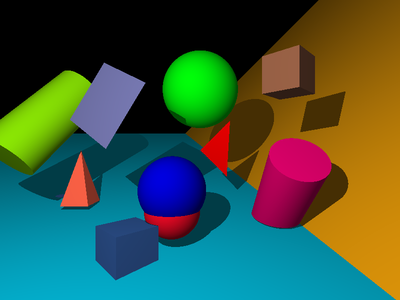

#miniRT

> A small ray tracing render in C


--- 

## INSTRUCTIONS

Download and compile (project works with Linux and MacOS)
``` bash
git clone https://github.com/poringdol/miniRT.git && make
``` 
Execute: `./miniRT scene_name.rt` for showing render image in window or `./miniRT scene_name.rt --save` for save it to bmp.

**Control keys**
    Key  | Action
---  | ---
**ESC**  | Close window and exit
**SPACE**| Next camera
  **S**  | Save current image to bmp

 Key | Effect
---  | ---
**F**| Sepia
**Z**| Anti aliasing (shine on 3D figures)
**R**| Rainbow
**G**| Strange effect

**How to define object in scene**
Example
```bash
R 800 600
A 0.3 255,255,255

c   0,0,0       0,0,1    80
c   15,0,7      -1,0,0   80
l   -2,-2,0     0.3      255,0,255
ld  1,0,0       0.5      255,255,255

sp 0,-2,8     2.5        0,255,20
pl 2,3,0      0,1,0.1    5,200,235  
tr 1,1,9      0,0,9      1,-1,8     255,0,0
sq -2,-1,5    0.5,0.3,1  1.5        123,124,183
cy 2.5,0.2,6  0,1,1      1.5        3.0         255,3,123
cu 2,-2,6     1,0,1 1  	 155,99,71
py -4.5,2,9   0,-1,0     1          2           255,99,71
```

#### Resolution:
```bash
R 1920 1080
```
 - identifier: R
 - x render size
 - y render size
(Only one declare per scene)

#### Ambient lightning:
```bash
A 0.2 255,255,255
```
 - identifier:A
 - ambient lighting ratio in range [0.0,1.0]: 0.2
 - R,G,B colors in range [0-255]: 255, 255, 255
(Only one declare per scene)

#### Camera:
```bash
c  -50.0,0,200,0,1   70
```

 - identifier:c
 - x,y,z coordinates of the view point: 0.0,0.0,20.6
 - 3d normalized orientation vector. In range [-1,1] for each x,y,z axis: 0.0,0.0,1.0
 - FOV: Horizontal field of view in degrees in range [0,180]

#### Light:
```bash
l   -40.0,50.0,0.0  0.6 10,0,255
```
 - identifier: l
 - x,y,z coordinates of the light point: 0.0,0.0,20.6
 - the light brightness ratio in range [0.0,1.0]: 0.6
 - R,G,B colors in range [0-255]: 10,0,255
  
#### Sphere:
```bash
sp  0.0,0.0,20.6  12.6  10,0,255
```

 - identifier: sp
 - x,y,z coordinates of the sphere center: 0.0,0.0,20.6
 - the sphere diameter: 12.6
 - R,G,B colors in range [0-255]: 10,0,2557

#### Plane:
```bash
pl  0.0,0.0,-10.0  0.0,1.0,0.0  0,0,225
```
 - identifier: pl
 - x,y,z coordinates: 0.0,0.0,-10.0
 - 3d normalized orientation vector. In range [-1,1] for each x,y,z axis: 0.0,0.0,1.0
 - R,G,B colors in range [0-255]: 0,0,255
 
#### Square:
```bash
sq  0.0,0.0,20.6   1.0,0.0,0.0  12.6  255,0,255
```

 - identifier: sq
 - x,y,z coordinates of the square center: 0.0,0.0,20.6
 - 3d normalized orientation vector. In range [-1,1] for each x,y,z axis: 1.0,0.0,0.0
 - side size: 12.6
 - R,G,B colors in range [0-255]: 255,0,255
 
#### Cylinder:
```bash

cy  50.0,0.0,20.6   0.0,0.0,1.0  10,0,255   14.2 21.42
```
 - identifier: cy
 - x,y,z coordinates: 50.0,0.0,20.6
 - 3d normalized orientation vector. In range [-1,1] for each x,y,z axis: 0.0,0.0,1.0
 - the cylinder diameter: 14.2
 - the cylinder height: 21.42
 - R,G,B colors in range [0,255]: 10,0,255
 
#### Triangle:
```bash
tr 10.0,20.0,10.0 10.0,10.0,20.0  20.0,10.0,10.0  0,0,255
```
 - identifier: tr
 - x,y,z coordinates of the first point: 10.0,20.0,10.0
 - x,y,z coordinates of the second point: 10.0,10.0,20.0
 - x,y,z coordinates of the third point: 20.0,10.0,10.0
 - R,G,B colors in range [0,255]:0, 255, 255

#### Cub:
```bash
сг 2,-2,6     1,0,1   3.2  	 155,99,71
```
 - identifier: cu
 - x,y,z coordinates of the center of the base of the cylinder: 2,-2,6
 - 3d normalized orientation vector. In range [-1,1] for each x,y,z axis: 1,0,1
 - side size: 3.2
 - R,G,B colors in range [0-255]: 155,99,71

#### Pyramid:
```bash
py -4.5,2,9   0,-1,0     3          2           255,99,71
```
 - identifier: py
 - x,y,z coordinates of the center of the base of the pyramid: 0.0,0.0,20.6
 - 3d normalized orientation vector of the base. In range [-1,1] for each x,y,z axis: 1.0,0.0,0.0
 - size of the side of the base of the pyramid: 3
 . pyramid height: 2
 - R,G,B colors in range [0-255]: 255,99,71

 